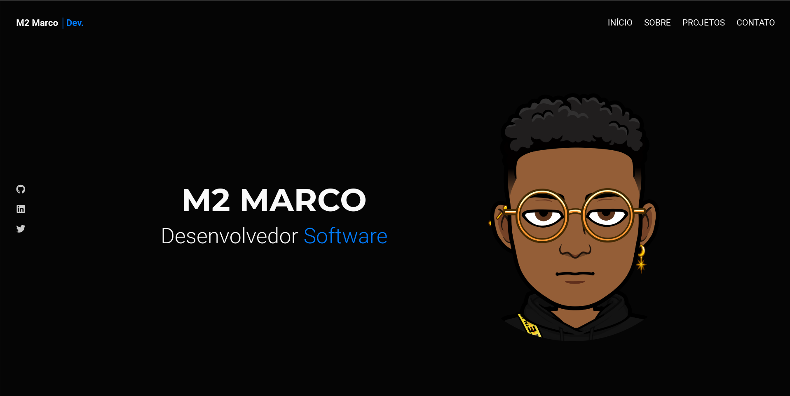

<h1 align="center">M2 Marco</h1>

###

  

###

<h1 align="left">Meu Portfólio</h1>

###

Bem-vindo ao meu portfólio! Aqui você encontrará uma coleção dos meus projetos de desenvolvimento de software e outras iniciativas que demonstram minhas habilidades e experiência na área. Este repositório serve como uma vitrine dos trabalhos que realizei, mostrando desde simples aplicações web até projetos mais complexos, utilizando uma variedade de tecnologias.

###

<h2 align="left">Tecnologias Utilizadas</h2>

###

 - HTML/CSS: Estruturação e estilização de páginas web, incluindo uso de frameworks modernos.   - JavaScript: Interatividade e funcionalidades dinâmicas.   - git e github: Controle de versão e colaboração em código.

###

  
  
  
  
  
  
  
  
  

###